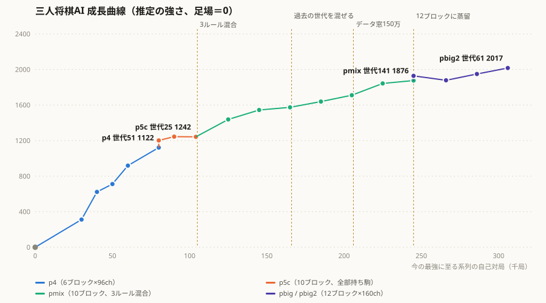

# 三人将棋

9×9盤で3人が同時に対局する将棋です。2つの部分からなります。

1. **ブラウザのゲーム**（`shogi3.html` と JS）：人が遊ぶ画面と、手作りの評価関数で指すCPU。
2. **自己対局で学習したAI**（`engine-rs/` の Rust と `python/` の PyTorch）：AlphaZero / KataGo 系の方式（MCTS＋ニューラルネット）で、ルールと勝敗だけから学習したAI。手作りのCPUよりずっと強い。ブラウザの難易度「🧠 学習AI」で対戦できる（下記）。

ルールは [RULES.md](RULES.md)、学習AIの設計と結果は [docs/](docs/README.md) を参照。



駒価値だけで読む足場（0）から、今の最強（pbig2 世代61）まで、直接対戦の勝率から積み上げた推定の強さ。詳しくは [docs/results.md](docs/results.md)。

## 遊び方

**ブラウザで今すぐ遊ぶ：https://sphosino.github.io/shogi3/shogi3.html** （難易度で「🧠 学習AI」を選ぶと、学習したAIがあなたのPCのGPUで動きます。GPUが使えなければCPUで、少し弱く遅くなります）

### 手作りのCPUと対局する

`shogi3.html` をブラウザで開く（サーバー不要）。

### 学習AIと対局する

学習したネットはGPUで動かすので、ローカルのサーバーを起動してから開く。学習済みの重みは [Releases](https://github.com/sphosino/shogi3/releases) からダウンロードできる（現時点の最強は `shogi3-pbig2-gen61.pt`）。

```
python/.venv/Scripts/python.exe python/scripts/play_server.py --model shogi3-pbig2-gen61.pt   # ダウンロードした重み
python/.venv/Scripts/python.exe python/scripts/play_server.py --run pbig2 --gen 61           # 自分で学習した runs/ の重み
```

`http://localhost:8765/shogi3.html` を開き、難易度で **🧠 学習AI** を選ぶ。1手あたり800回探索する（GPUが空いていれば1手1〜3秒）。F12のコンソールに、AIが指すたびに3人の勝率予想が出る。

- `--run` / `--gen` で使うネットを選ぶ（省略すると `--run` の最新の世代）。
- 取り駒ルール3種すべてで指せる。ルールはネットにも入力として渡す（[docs/ai_architecture.md](docs/ai_architecture.md)）。
- サーバーにつながらないとき（ファイルを直接開いたときなど）は、中級の手作りCPUが代わりに指す。

## ファイル構成

```
shogi3.html, shogi3.css   画面
constants.js              定数・グローバル変数（難易度「学習AI」の設定もここ）
game.js                   初期化・合法手生成・手の適用・学習AIへの問い合わせ（netMove）
attack-maps.js            利き筋マップ
ai.js, engine.js          手作りのCPU（評価関数＋探索）
render.js, ui.js          描画・操作

engine-rs/                Rust
  core/                   ルール（盤・指し手生成・終局判定）。JS実装と完全一致を確認済み
  mcts/                   3人用MCTS、駒価値の足場の評価器
  py/                     Python から呼ぶモジュール shogi3_rs（自己対局ドライバ・1局面の探索）
python/
  shogi3ml/               ネット・入力の作り方・学習データ・損失
  scripts/                学習ループ・蒸留・評価・分析・対局サーバー
runs/                     学習の成果物（モデル・自己対局データ・ログ。git管理外）
docs/                     設計書と結果
tools/                    JS用の道具（手作りCPUの自己対局・ベンチ・Rust照合用データ作成）
gpu_sleep_guard.ps1       長時間の学習中にPCがスリープ・省電力にならないようにする
```

## 学習AIの環境構築

- Rust（cargo）、Python 3.12、NVIDIA GPU（RTX 3080 で開発）。
- Python の仮想環境は `python/.venv`。PyTorch（CUDA版）と maturin を入れる。
- Rust のモジュールをビルドして仮想環境に入れる：

```
cd engine-rs/py
VIRTUAL_ENV=../../python/.venv ../../python/.venv/Scripts/maturin.exe develop --release
```

- 学習中は、読み込まれている `shogi3_rs` を上書きできない。対局サーバーは `engine-rs/target/play/` に置いた別のコピーを優先して読む（`maturin build` した wheel を展開して置く）。

## 学習を回す

リポジトリ直下で実行する。ログは `runs/<実行名>/log.txt`、評価は `eval.jsonl`。

```
# 今の本線：3つのルールを混ぜて、p5c 世代25から学習（docs/training.md）
python/.venv/Scripts/python.exe python/scripts/train_loop.py --run pmix --rule mix --init p5c:25 --gens 20 \
  --games-per-gen 1000 --window 600000 --lr 0.005 --lr-warm 0.002 --lr-warm-gens 3 \
  --eval-every 5 --eval-games 150 --eval-vs gen:1

# 評価（1体 vs 同じ相手2体、席は毎局入れ替え。互角なら33.3%）
python/.venv/Scripts/python.exe python/scripts/eval_models.py --run p5c --gen 25 --vs ext:p4:51 gen:1 --games 300

# 自己対局データの分析（席の有利不利・脱落・駒得と勝率）
python/.venv/Scripts/python.exe python/scripts/analyze_games.py --run p4
```

離席中に長く回すときは、先に `gpu_sleep_guard.ps1` を起動しておく。Windows が学習プロセスを省電力（Eコア・低クロック）に回して約4倍遅くなるのと、自動スリープで止まるのを防ぐ。

## 手作りのCPU（参考）

学習AIの前に作った、評価関数＋探索のCPU。ブラウザの難易度 入門〜上級 はこちら。

| 項目 | 内容 |
|---|---|
| 探索 | 反復深化 minimax（三つ巴時はパラノイド探索。`AI_THREEWAY_SEARCH` で max^N / BRS に切替可）|
| 静止探索 | 末端で駒取りのみを最大4手延長 |
| 枝刈り | α-β法 + 置換表 + futility枝刈り + LMR + ランク別スライス |
| 評価 | 駒価値 + モビリティ + 王安全度 + 入玉距離ボーナス |

パラメータ比較（候補1席 vs 基準2席）：

```
node tools/selfplay.js --games 132 --time 2000 --cand '{"AI_DANGER_SCALE":0.4}'
```

`--time` は実際の思考時間より200ms長く指定する（2000 = 中級）。

## Gen101で見えた、3人将棋らしい一局

学習を世代101まで進めたころ、人間が対局していて、**3人将棋では手番そのものが戦略になる**ことを強く実感した一局があった。

青（人間）は、それまで「自分の玉への王手には、自分の手番で対応すればいい」という感覚で指していた。しかし3人将棋では、それだけでは足りない。

青→赤→緑の順に手番を回す場合、**緑から青への王手**なら、青は次の手番で対応できる。ところが、**赤から青への王手**では、赤の次の手番は緑になる。青はすぐに王手に対応できず、【赤、緑】と連指しされることになる。

実際の対局では、この違いを人間側は警戒できていなかった。そこを赤と緑に突かれ、**赤からの王手、続いて緑からの王手という両方の王手によって、たった2枚の駒で簡単に詰まされてしまった**。

このとき人間側が特に「スゲー」と感じたのは、全然大丈夫そうな玉が**あっという間に急に詰んで**しまったことだ。
これで、**自分の次の相手からの王手は、自分ではすぐに対応できないから危険なんだ**と僕のニューラルネットワークが更新された。

つまり、

- 自分の前の相手からの王手 → 自分の手番になるので対応できる
- 自分の次の相手からの王手 → 自分の手番にならず、もう一人の相手が動く

という、3人将棋ならではの手番の構造が、実戦で初めてはっきり見えた。

そして、この発見の直後に、もう一つ「ちゃっかりしてるなｗ」と感じる展開があった。

青はすでに**赤の駒1枚と緑の駒1枚によって詰まされていた**。藁にも縋る思いで、赤か緑のどちらかの駒を取るしかなく、今回は赤の駒を取った。

そこで赤は、**持ち駒を緑陣に単騎で打ち込んだ**のである。当たり前だが、王手ではないところが憎い。

もしここで緑玉に王手をかければ、緑は王手を解除するために、その赤の駒を取ることになる。しかし王手ではないので、緑はその攻撃への対応を後回しにして青玉を取る。そのあいだに赤は、緑陣に打ち込んでおいた駒で**緑の駒をちゃっかり回収する**。

つまり後半では、

**青が赤の駒を取る → でも緑からの王手を解除できていない → 赤はその直後に利益を取れるよう、緑玉ではない【緑駒】に攻撃を仕込んでおく → 緑が青を倒す → 赤が緑から回収する**

という流れになっていた。

前半では「誰から王手されるかで危険度が変わる」という**手番の重要性**を人間側が身をもって発見し、後半ではAIがその手番の連鎖を利用するような、**3人将棋ならではのちゃっかりした一手**を見せた。

Gen101の評価値だけを見れば、従来世代からの伸びは大きく見えなかった。しかし実際に対局してみると、こうした**「誰の次に誰が動くか」そのものが戦略になる3人ゲーム特有の思考**が見えてきた。これは、このAIの学習で特に印象に残った一局である。

自己対局のデータにも、同じ構造が数字で出ている。最初の脱落が起きたとき、玉を取ったのが「脱落した人の次の手番の人」ならその人の勝率は55.5%、「前の手番の人」なら43.0%だった（[docs/experiments.md](docs/experiments.md) の「脱落させた人は得をするか」）。
